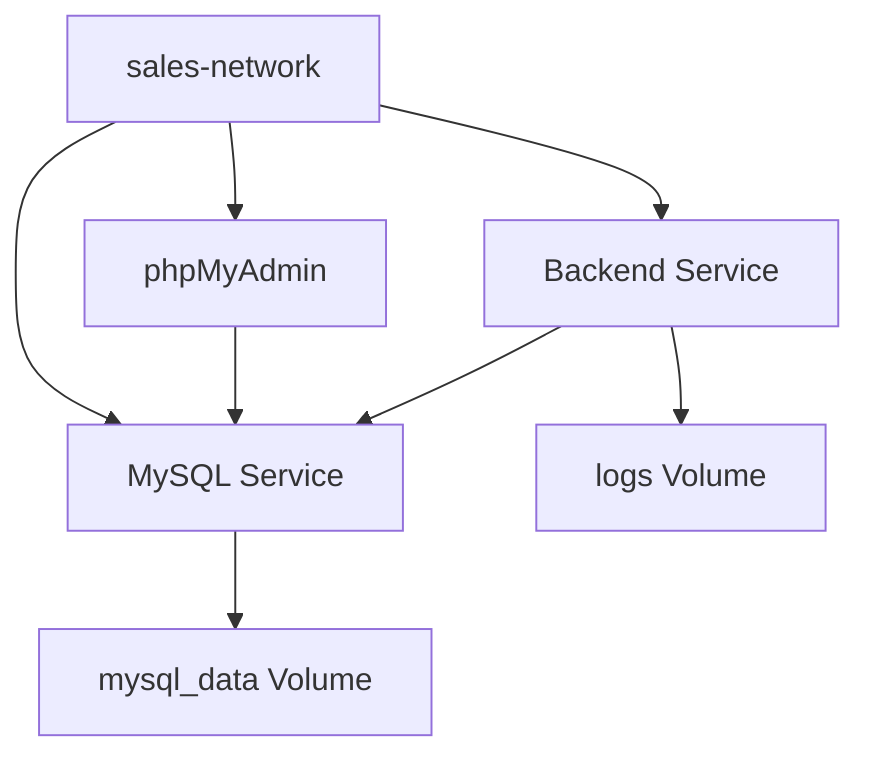

# Docker Containerization Setup - Complete Summary

## 🎯 Overview

I have successfully created a complete Docker containerization setup for your Spring Boot Sales Management System backend application. The setup includes all requested components and follows Docker best practices.

## 📁 Files Created

### Core Docker Files
1. **`Dockerfile`** - Multi-stage build for Spring Boot application
2. **`docker-compose.yml`** - Orchestrates backend + MySQL + phpMyAdmin services
3. **`.dockerignore`** - Optimizes build context (already existed, verified)

### Configuration Files
4. **`src/main/resources/application-docker.properties`** - Docker-specific configuration
5. **`docker/mysql/init/01-init.sql`** - MySQL initialization script

### Build and Management Scripts
6. **`docker-build.sh`** - Linux/macOS build and management script
7. **`docker-build.bat`** - Windows build and management script
8. **`test-docker-setup.sh`** - Validation script for Docker setup

### Documentation
9. **`README-Docker.md`** - Comprehensive Docker setup documentation
10. **`DOCKER_SETUP_SUMMARY.md`** - This summary document

### Configuration Updates
11. **Updated `src/main/resources/application.properties`** - Added environment variable support

## 🚀 Quick Start Commands

### For Linux/macOS:
```bash
# Make scripts executable (if needed)
chmod +x docker-build.sh test-docker-setup.sh

# Test the setup
./test-docker-setup.sh

# Build and start everything
./docker-build.sh all
```

### For Windows:
```cmd
# Test the setup (if you have bash/WSL)
bash test-docker-setup.sh

# Build and start everything
docker-build.bat all

# Or use Docker Compose directly
docker-compose up -d
```

### Manual Docker Compose:
```bash
# Build the application first
mvn clean package -DskipTests

# Start all services
docker-compose up -d

# Start with phpMyAdmin
docker-compose --profile tools up -d
```

## 🏗️ Architecture

### Services Configuration
- **Backend**: Spring Boot app on port 8081
- **MySQL**: Database on port 3307 (external), 3306 (internal)
- **phpMyAdmin**: Database management on port 8080 (optional)

### Key Features
- **Multi-stage Docker build** for optimized image size
- **Health checks** for all services
- **Persistent data storage** with named volumes
- **Custom network** for service communication
- **Environment variable** support for configuration
- **Security**: Non-root user in containers
- **Automatic database initialization**

## 🔧 Configuration Details

### Environment Variables
The setup supports the following environment variables:

```yaml
# Database Configuration
DB_HOST: mysql-db
DB_PORT: 3306
DB_NAME: sales_management
DB_USERNAME: sales_user
DB_PASSWORD: sales_password

# Application Configuration
JWT_SECRET: your-jwt-secret
JWT_EXPIRATION: 86400000
JAVA_OPTS: "-Xmx1g -Xms512m"
```

### Database Setup
- **MySQL 8.0** with native password authentication
- **Persistent storage** via Docker volume
- **Automatic database creation** with proper permissions
- **Health checks** to ensure database readiness
- **Initialization script** for optimizations

### Application Configuration
- **Java 17** runtime environment
- **Spring profiles**: `docker` profile for containerized environment
- **Health endpoint**: `/api/auth/test` for Docker health checks
- **Logging**: Configured for container environment
- **Security**: JWT-based authentication preserved

## 📊 Service Dependencies



## 🛠️ Management Commands

### Using Build Scripts
```bash
# Available commands for both .sh and .bat scripts
./docker-build.sh build     # Build app and Docker image
./docker-build.sh start     # Start the Docker stack
./docker-build.sh stop      # Stop the Docker stack
./docker-build.sh restart   # Restart the Docker stack
./docker-build.sh logs      # Show logs from all services
./docker-build.sh clean     # Clean up Docker resources
./docker-build.sh all       # Build and start everything (default)
./docker-build.sh help      # Show help message
```

### Using Docker Compose Directly
```bash
docker-compose up -d                    # Start services
docker-compose down                     # Stop services
docker-compose logs -f                  # View logs
docker-compose ps                       # Check status
docker-compose --profile tools up -d    # Include phpMyAdmin
```

## 🔍 Testing and Validation

### Health Check Endpoints
- **Backend**: `http://abusaker.zapto.org:8081/api/auth/test`
- **MySQL**: Internal health check via mysqladmin
- **phpMyAdmin**: `http://abusaker.zapto.org:8080`

### Validation Script
Run the test script to validate your setup:
```bash
./test-docker-setup.sh
```

This tests:
- Docker and Docker Compose availability
- Required files presence
- Port availability
- Application build process
- Docker image build
- Configuration syntax
- Environment variables

## 🔒 Security Features

### Container Security
- **Non-root user** in application container
- **Minimal base images** (OpenJDK slim)
- **Security updates** in base images
- **Network isolation** via custom Docker network

### Application Security
- **JWT authentication** preserved
- **Environment variable** support for secrets
- **Database user** with limited privileges
- **CORS configuration** maintained

## 📈 Performance Optimizations

### Docker Optimizations
- **Multi-stage build** reduces image size
- **Layer caching** for faster rebuilds
- **Health checks** ensure service readiness
- **Resource limits** can be configured

### Application Optimizations
- **Connection pooling** configured
- **JVM tuning** via JAVA_OPTS
- **Database optimizations** in init script
- **Logging configuration** for containers

## 🚨 Troubleshooting

### Common Issues and Solutions

1. **Port Conflicts**: Modify ports in `docker-compose.yml`
2. **Memory Issues**: Adjust `JAVA_OPTS` or Docker memory limits
3. **Database Connection**: Check MySQL container logs and network
4. **Slow Startup**: Increase health check timeouts

### Debug Commands
```bash
# Check container logs
docker-compose logs backend
docker-compose logs mysql-db

# Enter containers
docker-compose exec backend bash
docker-compose exec mysql-db mysql -u sales_user -p

# Check network connectivity
docker-compose exec backend ping mysql-db

# Monitor resources
docker stats
```

## 🎯 Next Steps

### For Development
1. Run `./test-docker-setup.sh` to validate setup
2. Start services with `./docker-build.sh all`
3. Test API endpoints at `http://abusaker.zapto.org:8081`
4. Use phpMyAdmin at `http://abusaker.zapto.org:8080` for database management

### For Production
1. Change default passwords and secrets
2. Configure SSL/TLS certificates
3. Set up proper logging and monitoring
4. Configure resource limits and scaling
5. Implement backup strategies for data volumes

## ✅ Verification Checklist

- [ ] All Docker files created and configured
- [ ] Environment variables properly set up
- [ ] Database initialization script created
- [ ] Health checks configured for all services
- [ ] Build scripts created for both platforms
- [ ] Documentation completed
- [ ] Test script validates setup
- [ ] Application.properties updated for Docker support

## 📞 Support

If you encounter any issues:
1. Run the validation script: `./test-docker-setup.sh`
2. Check the comprehensive documentation in `README-Docker.md`
3. Review Docker Compose logs: `docker-compose logs`
4. Verify all required files are present and properly configured

The Docker setup is now complete and ready for use! 🎉
